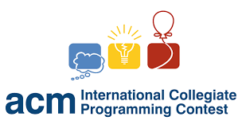
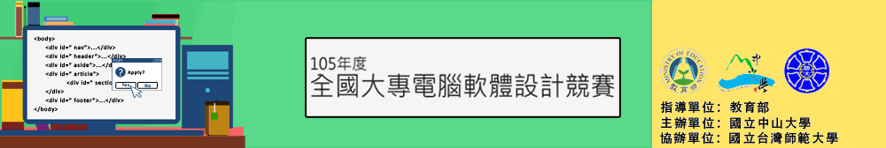

## 關於我

我是一個對於資訊充滿熱誠的學生，對於資工課程外的學習也抱以主動的態度，大一時就甄
選進入學校電算中心網管工讀。常常因為好奇心而不斷挖坑給自己進入，最近也在ＤＩＹ四
軸飛行器，從機架飛控版(arduino)到遙控器(arduino)都自行土炮，看到這次ArkLab實習，
讓我躍躍欲試，希望有機會做更深入學習

## 經歷

sdf|經歷|內容
----------|---------------|---------------------------------
|電算中心網管|系統維護
|衛保組網管|維護網頁及各資訊設備
|ACM-ICPC|八等獎
|NCPC|四等獎
|專題|以Rasperberry pi 實作 Wifi Access Point

